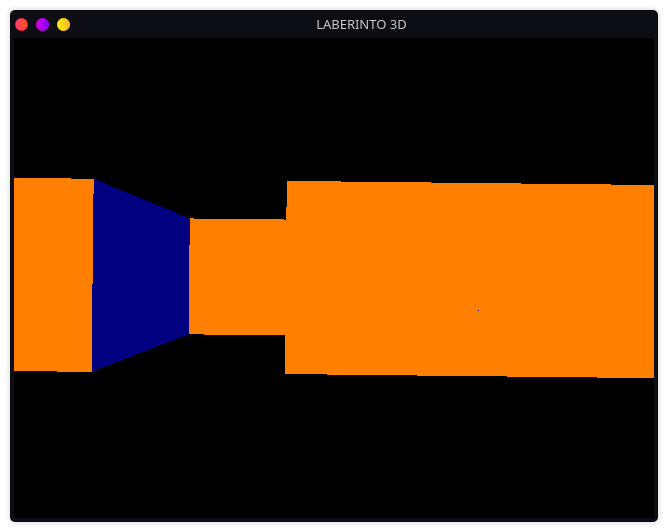

# Graficación 

Esta asignatura aporta la capacidad para diseñar modelos gráficos que requieran el trazado
y manipulación de objetos bidimensionales y tridimensionales, que coadyuven su
implementación en diversas áreas, tales como: simulación, arte, diseño, capacitación,
medicina, noticias, entretenimiento, entre otras.

## [UNIDAD I](UNIDAD_I)
- Algoritmo de Bresenham circunferencia.
- Algoritmo DDA.

### Ejemplos

 ## [UNIDAD II](UNIDAD_II)
- Algoritmo de Bresenham circunferencia.
- Creación de polígonos.
- Traslación de objetos.
- Escalado de objetos.

### Ejemplos

 ## [UNIDAD III](UNIDAD_III)
- Programación de gráficos en 2D.
- Uso de la librería Matplotlib.

### Ejemplos

 ## [UNIDAD IV](UNIDAD_IV)
- Programación de gráficos en 3D.
- Uso de la librería PyOpenGL.

### Ejemplos

